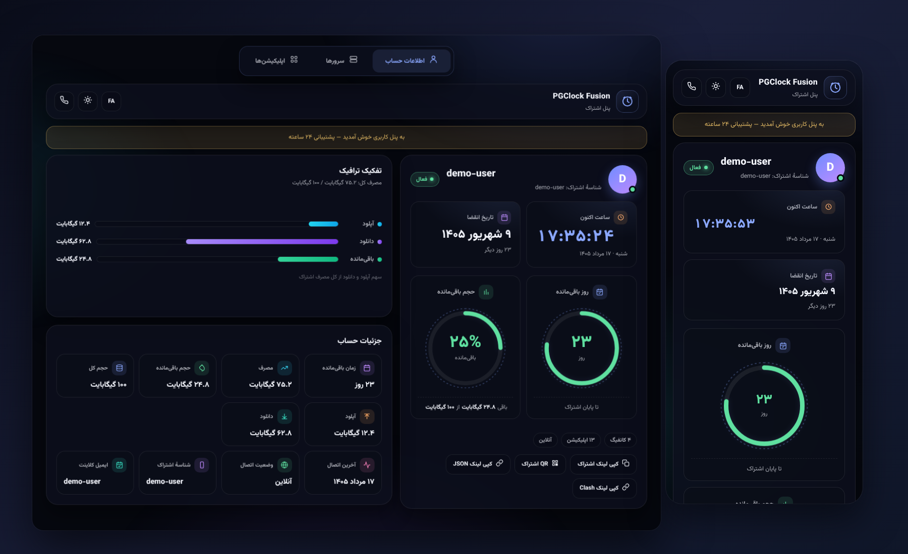

<div align="center">
  
</div>

<h1 align="center">PGClock Fusion 3X</h1>

<p align="center">
  نسخهٔ فیوژن برای پنل <b>3x-ui</b> (سنایی) — داشبورد سه‌تبی با ساعت زنده، تفکیک ترافیک و برندینگ سفارشی
</p>

<p align="center">
  <a href="#نصب-خودکار">نصب خودکار</a> ·
  <a href="#نصب-دستی">نصب دستی</a> ·
  <a href="#سفارشی‌سازی-برند">سفارشی‌سازی برند</a> ·
  <a href="#تنظیمات-پنل">تنظیمات پنل</a> ·
  <a href="#نسخه‌های-دیگر">نسخه‌های دیگر</a>
</p>

---

## ویژگی‌ها

- سه تب مجزا: **اطلاعات حساب** · **سرورها** · **اپلیکیشن‌ها**
- ساعت و تاریخ زندهٔ شمسی/میلادی (تقویم پیش‌فرض از تنظیم `Calendar Type` پنل خوانده می‌شود)
- حلقه‌های «روز باقی‌مانده» و «حجم باقی‌مانده» با رنگ وضعیت
- کارت **تفکیک ترافیک**: سهم آپلود، دانلود و حجم باقی‌مانده
- کارت‌های جزئیات: آخرین اتصال، وضعیت آنلاین، شناسهٔ اشتراک، ایمیل کلاینت
- کپی و QR برای هر کانفیگ + پرچم SVG کشور (نمایش یکسان در همهٔ سیستم‌عامل‌ها حتی ویندوز)
- کپی لینک‌های **اشتراک / JSON / Clash** پنل با یک کلیک
- افزودن مستقیم اشتراک به v2rayNG، Hiddify، Streisand، Shadowrocket، Happ، FlClash، sing-box و…
- به‌روزرسانی زندهٔ وضعیت هر ۳۰ ثانیه از `‎?format=info` (روی پنل‌های قدیمی‌تر بی‌صدا غیرفعال می‌شود)
- دو زبان **FA / EN** با RTL/LTR خودکار و دو تم **تیره / روشن**
- نام برند، زیرعنوان، لوگو و لینک پشتیبانی سفارشی (سازگار با اسکریپت نصب)
- حالت سبک (perf-lite) خودکار روی دستگاه‌های ضعیف
- یک فایل HTML — بدون Node.js و build

> **پیش‌نیاز:** 3x-ui نسخهٔ **v3.3.0** یا بالاتر. پشتیبانی از قالب سفارشی صفحهٔ اشتراک از این نسخه اضافه شده است.

---

## نصب خودکار

روی سروری که 3x-ui روی آن نصب است:

```bash
curl -fsSL https://raw.githubusercontent.com/Pasham0/PGClockFusion3X/main/install.sh -o /tmp/pgclock3x-install.sh && sudo bash /tmp/pgclock3x-install.sh
```

یا:

```bash
wget -qO /tmp/pgclock3x-install.sh https://raw.githubusercontent.com/Pasham0/PGClockFusion3X/main/install.sh && sudo bash /tmp/pgclock3x-install.sh
```

نصاب می‌پرسد که آیا می‌خواهید برند را سفارشی کنید؛ با Enter رد کنید تا برند پیش‌فرض بماند.

### اسکریپت چه کار می‌کند؟

1. بررسی نصب 3x-ui، پیدا کردن دیتابیس پنل و هشدار اگر نسخهٔ پنل قدیمی‌تر از v3.3.0 باشد
2. (اختیاری) دریافت نام برند، زیرعنوان، لینک پشتیبانی و لوگو و patch خودکار روی `index.html`
3. ذخیرهٔ قالب در:

```text
/etc/x-ui/sub_templates/pgclock-fusion/index.html
```

4. (با تأیید شما) بک‌آپ گرفتن از `x-ui.db` و نوشتن مسیر قالب در تنظیم `subThemeDir` و سپس `x-ui restart`
   — اگر «نه» بگویید، فقط مسیر را چاپ می‌کند تا خودتان در پنل واردش کنید.

> **پیش‌نیازها:** `wget`، `curl`، `python3`

---

## نصب دستی

### ۱. دانلود قالب

```bash
sudo mkdir -p /etc/x-ui/sub_templates/pgclock-fusion/
sudo wget -N -O /etc/x-ui/sub_templates/pgclock-fusion/index.html \
  https://raw.githubusercontent.com/Pasham0/PGClockFusion3X/main/index.html
sudo chmod 755 /etc/x-ui/sub_templates /etc/x-ui/sub_templates/pgclock-fusion
sudo chmod 644 /etc/x-ui/sub_templates/pgclock-fusion/index.html
```

### ۲. تنظیم پنل

پنل → **Settings → Subscription → Sub Theme Directory** و وارد کردن:

```text
/etc/x-ui/sub_templates/pgclock-fusion/
```

### ۳. راه‌اندازی مجدد

```bash
sudo x-ui restart
```

### ۴. مشاهده

لینک اشتراک را در مرورگر باز کنید:

```text
https://your-domain:2096/sub/SUB_ID?html=1
```

مرورگرها به‌طور خودکار هم نسخهٔ HTML را می‌گیرند؛ `‎?html=1` فقط برای اطمینان است. اپلیکیشن‌های کلاینت
همچنان همان لینک را به‌صورت متنی دریافت می‌کنند و چیزی برایشان عوض نمی‌شود.

---

## سفارشی‌سازی برند

اسکریپت نصب به‌صورت خودکار این کار را می‌کند؛ برای ویرایش دستی، ابتدای `index.html` این آبجکت را پیدا کنید:

```javascript
var DEFAULT_BRAND = {
  name: "PGClock Fusion",
  subtitle: { fa: "پنل اشتراک", en: "Subscription panel" },
  logoUrl: "",
  supportUrl: ""
};
```

- `name` — نام برند (در هدر نمایش داده می‌شود)
- `subtitle.fa` / `subtitle.en` — زیرعنوان برای هر زبان
- `logoUrl` — آدرس `https://` لوگو؛ خالی باشد آیکن پیش‌فرض نمایش داده می‌شود
- `supportUrl` — لینک پشتیبانی؛ اگر پنل خودش `subSupportUrl` داشته باشد، مقدار پنل اولویت دارد

**قرارداد قالب (این کلیدها را ثابت نگه دارید):** اسکریپت نصب دنبال `DEFAULT_BRAND` با فیلدهای `name`، `subtitle`، `logoUrl` و `supportUrl` می‌گردد.

### لیست اپلیکیشن‌ها

3x-ui لیست اپ ندارد، پس کاتالوگ اپ‌ها داخل خود قالب (آرایهٔ `APPS` در ابتدای اسکریپت) تعریف شده است.
در لینک‌های `import_url` این جای‌نگهدارها جایگزین می‌شوند:

| جای‌نگهدار | مقدار |
|---|---|
| `{sub}` | لینک اشتراک (`subUrl`) |
| `{clash}` | لینک Clash (`subClashUrl`) |
| `{json}` | لینک JSON (`subJsonUrl`) |

---

## تنظیمات پنل

- **Settings → Subscription → Sub Theme Directory** — مسیر قالب
- **Settings → Subscription → Sub Title / Support URL** — نام و لینک پشتیبانی که در صفحه نمایش داده می‌شود
- **Settings → Subscription → Announce** — متن اعلان بالای صفحه
- **Settings → Calendar Type** — انتخاب تقویم `jalali` یا `gregorian` (زبان پیش‌فرض صفحه از همین خوانده می‌شود)

اگر قالب مشکلی داشته باشد، پنل بی‌سروصدا به صفحهٔ پیش‌فرض خودش برمی‌گردد و خطا را در لاگ می‌نویسد:

```bash
x-ui log | grep -i "sub:"
```

---

## نسخه‌های دیگر

- [PGClock Fusion](https://github.com/Salarlotfi1381/PGClockFusion) — همین قالب برای پنل **Pasarguard**
- [PGClock Lite](https://github.com/Mrclocks/PGClockLite) — سبک‌تر و سریع‌تر
- [PGClock](https://github.com/Mrclocks/PGClock) — نسخهٔ استاندارد
- [PGClock Pro](https://github.com/Mrclocks/PGClockPRO) — برند، زیرعنوان و لوگوی سفارشی

---

## تغییرات

### v1.1.0 — ۱۴۰۵/۰۵/۱۶

- **پاک‌سازی CSS دسکتاپ**: قوانین باقی‌ماندهٔ bar chart (`.bars`، `.bar-wrap`، `.bar b`) از بلوک `@media (min-width: 860px)` حذف شد و با `.split { min-height: 230px }` جایگزین گردید — در نسخهٔ سنایی نمودار میله‌ای وجود ندارد و این کدها بی‌استفاده بودند

### v1.0.0

- انتشار اولیه برای 3x-ui: لایهٔ دادهٔ صفحه از Go template پنل خوانده می‌شود (`sId`، `enabled`، `isOnline`،
  `upload/download/total/used/remained`، `expire`، `lastOnline`، `links`، `emails`، `announce`، `datepicker` و لینک‌های اشتراک)
- کارت تفکیک ترافیک به‌جای نمودار مصرف روزانه (3x-ui دادهٔ سری‌زمانی ندارد)
- کاتالوگ اپلیکیشن‌ها با افزودن مستقیم اشتراک
- سازگار با v3.3.0 به بالا؛ کلیدهایی که در نسخه‌های قدیمی‌تر وجود ندارند بی‌صدا نادیده گرفته می‌شوند
